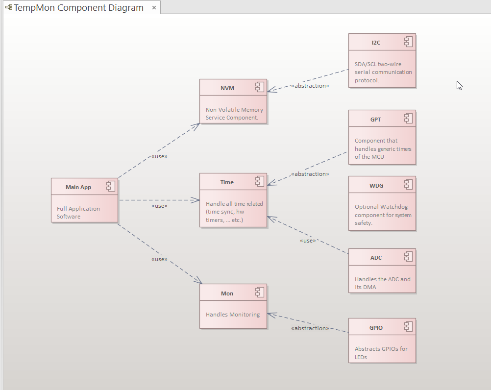
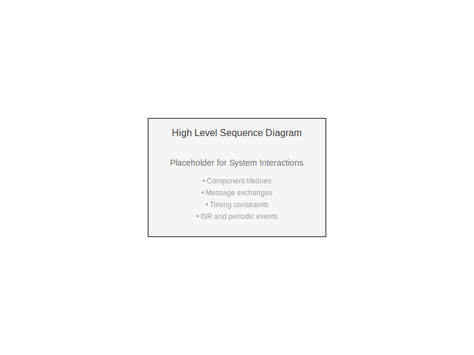
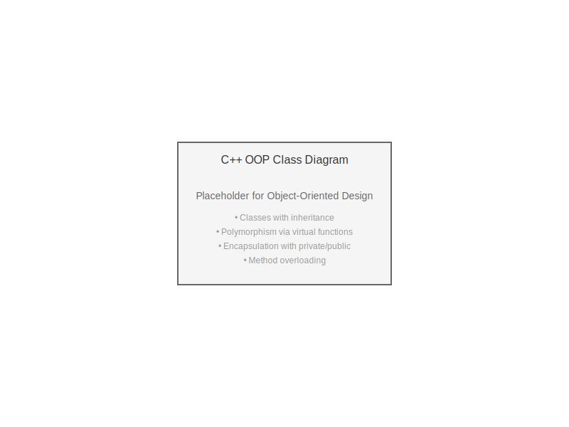
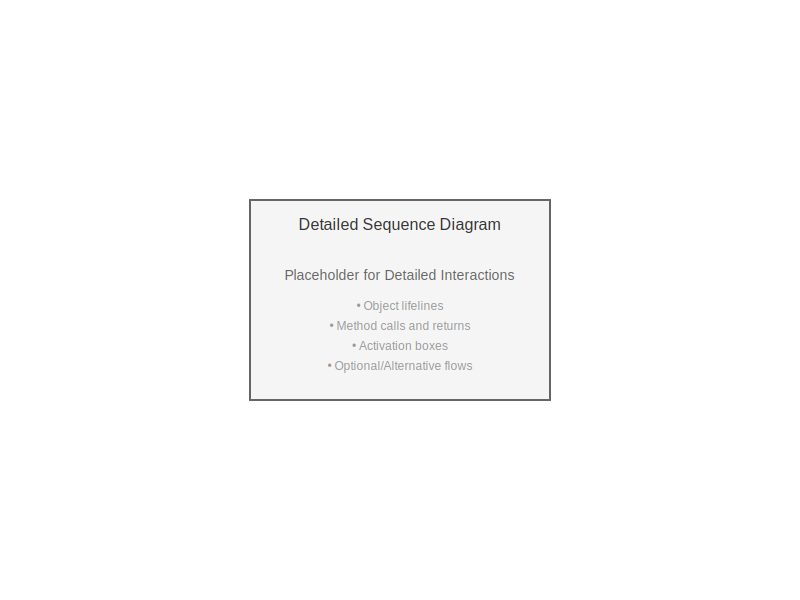

This section summarizes the main software layers and components used to implement TempMon.

Use Case Diagram
----------------

The use case diagram shows the functional requirements and interactions with the system.

.. image:: ../arch/swe2/use_case_diagram.drawio.svg
   :alt: TempMon Use Case Diagram
   :align: center
   :width: 90%

Component Diagram
-----------------

The component diagram illustrates the software components and their relationships.

Deployment Diagram
------------------

The deployment diagram shows the mapping of software components to hardware resources.

.. image:: ../arch/swe2/deployment_view.drawio.svg
   :alt: TempMon Deployment Diagram
   :align: center
   :width: 90%

Interface Diagram
-----------------

Skipped for the scope of this task.

High Level Sequence Diagram
----------------------------

The sequence diagram shows the dynamic behavior and interaction between software components during system operation.

SWE.3 Software Detailed Design
----------------------------

C++ OOP Implementation
~~~~~~~~~~~~~~~~~~~~~~~

Class Diagram (OOP)
^^^^^^^^^^^^^^^^^^^

Object-oriented class diagram showing C++ classes with inheritance, polymorphism, and encapsulation.

C Implementation
~~~~~~~~~~~~~~~~~

Class Diagram (C)
^^^^^^^^^^^^^^^^^

Class diagram showing software units, their attributes, methods, and relationships.

.. note::
   In C, the term "class diagram" is used metaphorically to represent modular design:
   
   - **Public methods**: Functions declared in `.h` header files (external linkage)
   - **Private methods**: Static functions defined only in `.c` files (internal linkage)
   - **Attributes**: Module-level static variables or struct members

.. image:: ../arch/swe3/class_diagram.drawio.svg
   :alt: TempMon C Class Diagram
   :align: center
   :width: 90%

Activity Diagram
^^^^^^^^^^^^^^^^

Activity diagram showing the flow of operations within software units.

.. image:: ../arch/swe3/activity_diagram.drawio.svg
   :alt: TempMon Activity Diagram
   :align: center
   :width: 90%

Detailed Sequence Diagram
^^^^^^^^^^^^^^^^^^^^^^^^^^

Detailed sequence diagram for complex unit interactions (optional).

Note: Other diagrams (state diagrams, package diagrams, etc.) are skipped due to time constraints.
