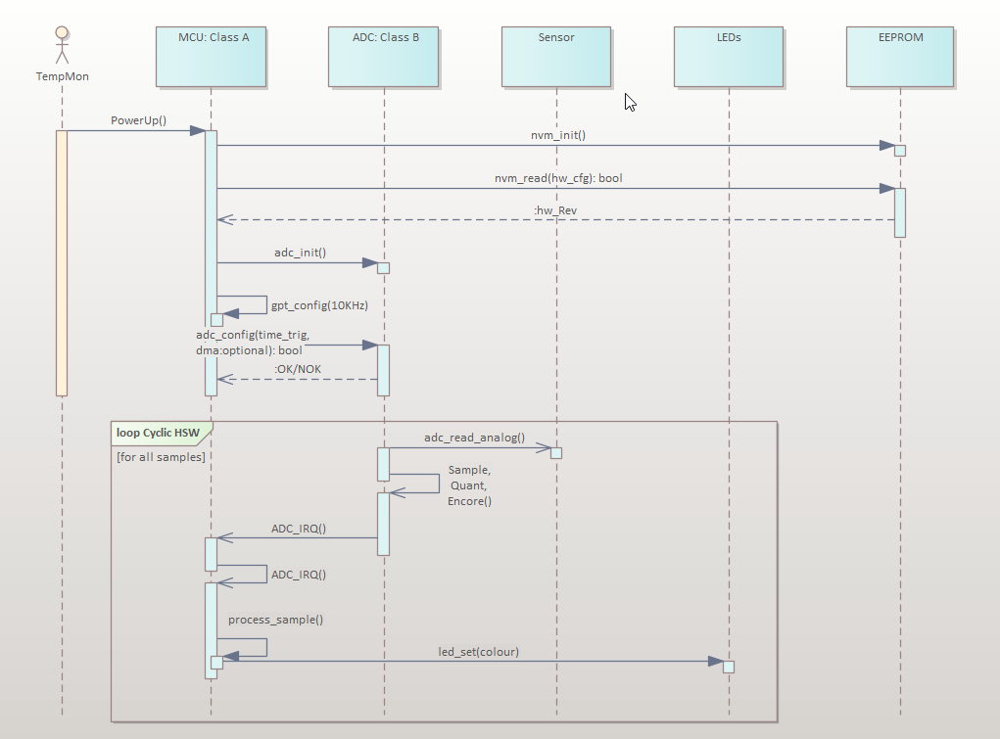

This section summarizes the main software layers and components used to implement TempMon.

High Level Design
-----------------

The diagram below shows the high-level software architecture and main building blocks.

